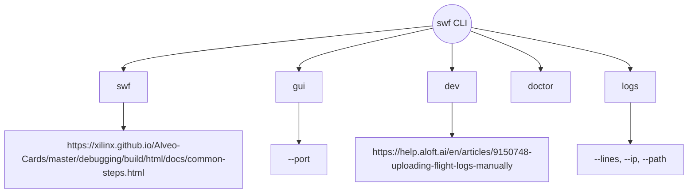

# Referência da CLI

Referência completa para a interface de linha de comando do SwiftHost.

## Uso Global
```bash
swf [comando] [opções] [argumentos]
```

# Visão Geral dos Comandos



# Comandos

`swf`
Cria um túnel para o seu servidor local.

# Uso:
```bash
swf [url-alvo] [opções]
```

# Argumentos:
| Argumento | Padrão | Descrição |
|---|---|---|
| target | http://localhost:3000 | URL do servidor local a ser exposto |

# Opções:
| Opção | Alias | Tipo | Padrão | Descrição |
|---|---|---|---|---|
| --url | -u | string | - | Alternativa ao argumento posicional |
| --port | -p | number | auto | Porta do proxy interno (9000+) |
| --debug | -d | boolean | false | Ativar log de depuração detalhado |
| --quiet | -q | boolean | false | Modo silencioso (exibe apenas a URL) |
| --logs | -l | boolean | false | Ativar log de requisições em database/ |
| --gui | -g | number/bool | false | Iniciar painel web (padrão: 7777) |
| --subdomain | - | string | - | Subdomínio personalizado (requer CF pago) |
| --help | -h | - | - | Exibir informações de ajuda |
| --version | -v | - | - | Exibir número da versão |

# Exemplos:
```bash
# Porta específica
swf http://localhost:8080

# Com opções
swf -u localhost:4000 -p 9001 -l -d

# Modo silencioso (útil em scripts)
swf -q > url_publica.txt
```

`swf gui`
Inicia o painel de gerenciamento web (dashboard).

# Uso:
```bash
swf gui [opções]
```

# Opções:

| Opção | Alias | Tipo | Padrão | Descrição |
|---|---|---|---|---|
| --port | -p | number | 7777 | Porta do servidor do painel |

`swf dev`
Modo de desenvolvimento com reconexão automática.

# Uso:
```bash
swf dev [url-alvo] [opções]
```

# Comportamento:
 * Recria o túnel automaticamente se a conexão cair.
 * Verificações de integridade (health checks) a cada 10 segundos.
 * Log detalhado (verbose) ativado por padrão.

`swf doctor`
Verifica os requisitos do sistema e a instalação.

# Uso:
```bash
swf doctor
```

# Verificações:
 * Versão do Node.js (>= 16)
 * Disponibilidade da CLI cloudflared
 * Permissões do diretório do banco de dados
 * Conectividade de rede

`swf logs`
Visualiza os logs de requisições recentes no terminal.

# Uso:
```bash
swf logs [opções]
```

# Opções:
| Opção | Alias | Tipo | Padrão | Descrição |
|---|---|---|---|---|
| --lines | -n | number | 50 | Número de entradas de log a exibir |
| --ip | - | string | - | Filtrar por endereço IP |
| --path | - | string | - | Filtrar pelo caminho (path) da URL |

# Variáveis de Ambiente

| Variável | Descrição | Exemplo |
|---|---|---|
| SWIFTHOST_DEBUG | Ativa o modo de depuração | 1 |
| SWIFTHOST_LOG_LEVEL | Verbosidade do log | debug |
| SWIFTHOST_DATABASE_PATH | Diretório de logs personalizado | ./logs |

# Códigos de Saída

| Código | Significado |
|---|---|
| 0 | Sucesso |
| 1 | Erro geral |
| 3 | Servidor alvo não encontrado |
| 4 | cloudflared não encontrado |
| 130 | Interrompido (Ctrl+C) |
